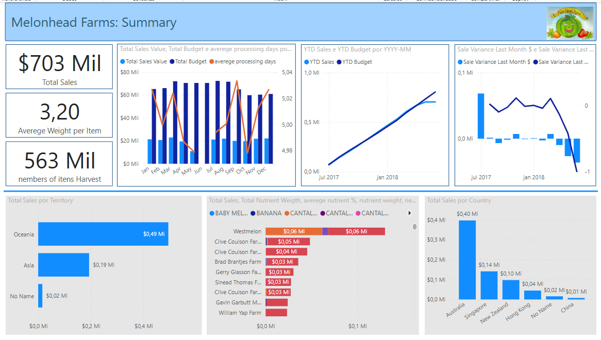
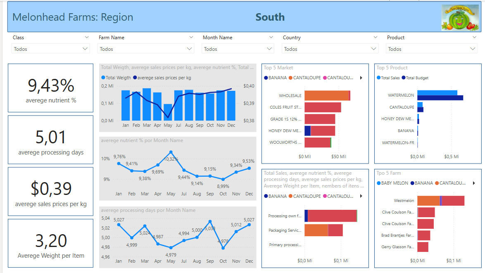
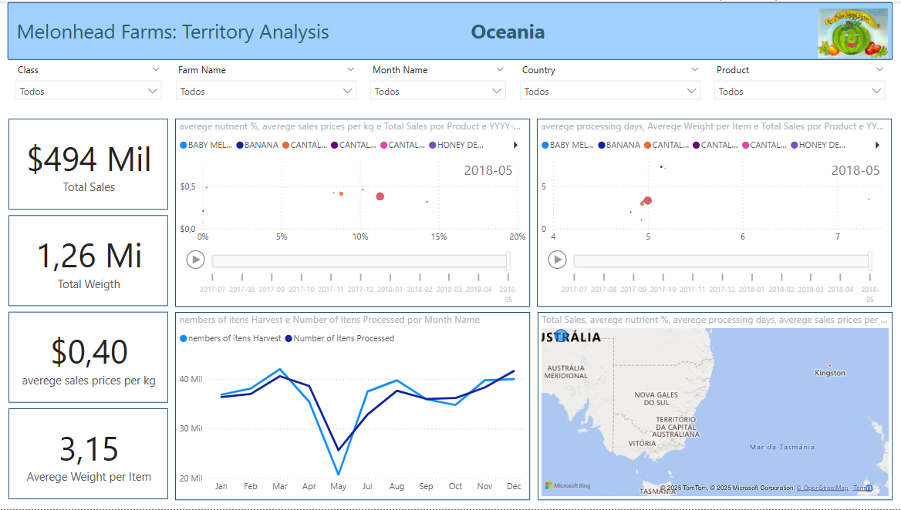

# Dashboard Melonhead Farms – Análise de Vendas, Produção e Desempenho Regional

Desenvolvido como parte prática do curso da Udemy ministrado por um professor da Starweaver, o conjunto de dashboards da Melonhead Farms apresenta uma análise completa do desempenho da produção, vendas e qualidade de produtos agrícolas distribuídos por diversas regiões e territórios. Composto por três páginas

---

## 📊 Dashboards
### Visão Regional (Regional View)
Focado na análise em uma região, este painel permite explorar:
- Indicadores médios como, teor de nutrientes: 9.43%, dias médios de processamento: 5.01 dias, preço médio de venda por kg: $0.39, peso médio por item: 3.20 kg.
- Evolução temporal de peso total e preço médio de venda, teor de nutrientes por mês, tempo médio de processamento.
- Principais mercados e produtos vendidos, com destaque para produtos como melancia e cantaloupe, clientes como Wholesale e Coles Fruit Stores. 
### Resumo Geral (Summary View)
Este painel fornece uma visão macro dos dados da empresa, incluindo:
- Vendas totais: $703 milhões.
- Peso médio por item: 3.20 kg.
- Volume total colhido: 563 milhões de unidades.
- Análises por território (com destaque para Oceania), país importador (ex: Austrália, Singapura, Nova Zelândia) e fazendas produtoras e contribuição individual.
- Tendência de vendas vs orçamento (YTD) e variações mensais de vendas
### Análise Territorial (Territory Analysis)
Este painel é voltado à análise específica da região da Oceania, e inclui:
- Vendas totais: $494 milhões
- Peso total vendido: 1.26 milhões
- Preço médio de venda por kg: $0.40
- Peso médio por item: 3.15 kg
- Análises detalhadas de teor de nutrientes vs preço e vendas por produto, dias de processamento vs desempenho por produto e evolução do número de itens colhidos e processados por mês e visualização geográfica das vendas na Austrália.

---

## 🗂️ Base de Dados
- Excel
- CSV

---

## 🛠️ Ferramentas Utilizadas
- Microsoft Power BI**: desenvolvimento dos dashboards interativos.
- Microsoft Excel**: apoio na manipulação e organização dos dados brutos.
- DAX e Power Query**: criação de medidas, colunas calculadas e transformação dos dados.

---

## 📈 Resultados

- **Summary View**

- **Region View**

- **Territory Analysis – Oceania**

---

### 👩‍💻 Contato

Estou disponível para propostas de emprego, auditorias de dados ou projetos relacionados à análise e visualização de dados. 
Todos os meus contatos estão disponíveis na minha página inicial do GitHub: [beto86](https://github.com/beto86). 
Sinta-se à vontade para visitar e entrar em contato!

